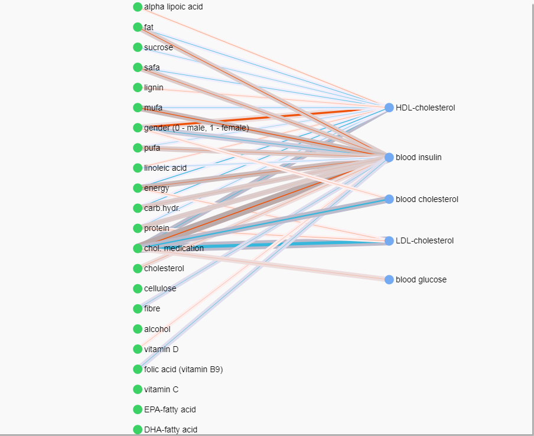

```{r setup, include=FALSE}
library(knitr)
knitr::opts_chunk$set(echo = TRUE, fig.align="center")

# Load common MEBN package
source("mebn\\MEBN.r")
```

## The Effects of Nutrition

Nutritional therapists have known for a long that people can react differently to the same nutrition. I am proposing a Mixed-Effect Bayesian Network (MEBN) as a method for modeling the effects of nutrition in both population and personal level. By the effects of nutrition we mean the way how people react to different levels of nutrients at their diets. There have been studies of these effects on limited cases, like personal glucose metabolism [@Zeevi2015], but MEBN would allow more general modeling.   

The Bayesian Networks (BN) are directed acyclic graphical models that contain both observed and latent random variables as vertices and edges as indicators of connection. In the setting of nutritional modeling the observed variables are nutrients at person's diet and their correponding bodily responses, like blood characteristics. The connections between these variables can be very complex and the BNs seem to be intuatively appealing method for modeling such a system.

Besides of the typical correlations at the system, we are interested in the personal variations at the reaction types. Are some people more sensitive to some nutrient than the others? If this information could be systemically quantified, it would allow us to predict personal networks of reaction types. This in turn, opens up lots of new applications in personal recommendations and health care.

For capturing these personal variances we need a dataset that contains several repeated measurements from number of persons. Measurements from each person are correlated with each other and a general method for modeling this correlation is hierarchical, or mixed-effect, model. The same model can be used to estimate the reaction type in both population and personal level.

Previously BNs have been considered mainly for uncorrelated observations [@Scutari2014, @Scutari2013, @Aussem2010], but in this work we are using Mixed-Effect Bayesian Network parametrization [@Bae2016] that allows combining the hierarchical mixed-effect modeling and Bayesian Network as a general framework for expressing the system.

This presentation covers first briefly the theory of graphical models and how it can be expanded to correlated observations. Then it is shown how this modeling can be implemented with Stan and what benefits fully Bayesian estimation can offer in understanding the uncertainty at the model. 

## Mixed-Effects Bayesian Network

Let us denote the graph of interconnected nutrients and responses with $G$. We can then formulate the modeling problem as  finding the graph $G$ that is most probable given the data $D$

\begin{align}
{P}({G}|{D})
\end{align}

By using Bayes' Rule we can be split this probability into proportions of data likelihood with given graph and any prior information we might have about suitable graphs 

\begin{align}
\label{prop_bayes_theorem}
{P}({G}|{D}) \propto {P}({D}|{G}) {P}({G})
\end{align}

Now the problem is converted into a search of the maximum likelihood graph for given data. If all the graphs are equally probable then \(P(G)\) is a constant and does not affect the search, but it can be also beneficial to use it to guide the search towards meaningful graphs [Bishop:2006:PRM:1162264, @Scutari2013].

**Decomposition of the likelihood.** Bayesian network factorizes into local distributions according to \textit{local Markov property} stating that a variable \(X_i\) is independent of its non-descendants given its parents at the graph. The \textit{global Markov property} states that a variable is independent of all the remaining variables in the graph conditionally on its \textit{Markov blanket} that consists its parents and child nodes at the graph, and additional parents of the child nodes [@Bae2016, @Koller:2009:PGM:1795555]. With this decomposition the joint probability of the graph can be calculated with sum and product rules of probability as a product of the independent local graphs \(G_i\). The graph structure depends also on the parameters \(\phi_i\) describing the dependencies and they should be taken into account at the estimation. We assume that \(\phi_i\) is a set that pools all the parameters that describe the relationship.

Likelihood of the data is then

\begin{align}
\begin{split}
\label{likelihood}
{P}({D}|{G}) \\ = \prod_{i=1}^{v} {P(X_i|pa(X_i), \phi_i, G_i)P(\phi_i|G_i)}  
\end{split}
\end{align}

assuming we have \(v\) independent local distributions at the graph. The notation $pa(X_i)$ denotes the parent variables of variable $X_i$ according to graph structure $G_i$. Since the probability of data in the graph depends on the parameters of the local distributions, \(\phi_i\), they have to be integrated out from the equation to make the probability of graph independent of any specific choice of parameters 

\begin{align}
\begin{split}
\label{joint_probability}
\prod_{i=1}^{v} \int {P(X_i|pa(X_i), \phi_i, G_i)P(\phi_i|G_i)} d\phi_i \\
= \prod_{i=1}^{v} {P(X_i|pa(X_i), G_i)P(G_i)} 
\end{split}
\end{align}

Besides the Markov properties, we also assume  _global independence of the parameters_ 

\begin{align}
\label{global_independence}
{\phi_i} \neq {\phi_j}, {i} \neq {j}
\end{align}

and for Bayesian estimation we assume _hyper-Markov law_ [@dawid1993] for ensure that these decompositions are indeed independent.


**Linear dependency between variables.** As we are more interested in the system and less considered about details of any specific nutritional response,  we consider it adequate to model the dependency between the nutrients and bodily responses with an approximate linear model. However, simple linear model is not enough, but we need a parametrization that is able to reflect the correlations between observations and express the amount of variability between persons since the data consists of several repeated measurements from different persons.

<center>

```{r, out.width = "600px", echo=FALSE, message=FALSE}
include_graphics("PGM.png", auto_pdf=TRUE)
```

</center>
</br>

Generally, the local probability distributions can be from exponential family of distributions, but in this example we consider only normally distributed response variables. Subset of parent nodes possibly containing personal variance is denoted with $pa_Z(X_i)$. For mixed-effect modeling we assume parameters \(\phi_i = \{\beta_i, b_i\}\) for expressing typical and personal reaction types. In multivariate normal model the uncertainty is furthermore defined by variance-covariance matrix $V_i$

\begin{align}
\begin{split}
\label{Normal LME}
{P}({X_i}|{pa(X_i), \phi_i, G_i}) \\ = N({X_i} | pa(X_i)\beta_i + pa_Z(X_i)b_i, V_i)
\end{split}
\end{align}

This theory motivates our search for optimal graph with Stan. By decomposing the joint likelihood into local probability distributions according to Markov properties it is possible to find the optimal graph by estimating one local distributions one by one.

## Estimating the Hierarchical Local Distributions with Stan

In the mixed-effect modeling the purpose is to explain some of the model's variance in $V_i$ with the latent personal effect variables $b_i$. These in turn offer us a way to detect and express the personal variations in nutritional effects. Let us assume that matrix $Z$ is a design matrix of personal effects. Then variance-covariance matrix is defined by

\begin{align}
\label{variance_matrix}
{V = Z D Z' + R}
\end{align}

where $R$ is a variance-covariance matrix of residuals and $D$ is a variance-covariance matrix of personal, or random-effects,

\begin{align}
\label{ranef_varcov_matrix}
{D = \mathcal{T} C \mathcal{T}'}
\end{align}

where $\mathcal{T}$ is a diagonal matrix of personal effect variances and $C$ is correlation matrix that can be divided into Cholesky decompositions as

\begin{align}
\label{ranef_corr_matrix}
{C = L L'}
\end{align}

and with $L$ we can define the personal effects as

\begin{align}
\label{personal_effects}
{b = L u, u \sim N(0, I)}
\end{align}

as we assume for now that personal random-effects are drawn from Normal distribution.

This is implemented in Stan as follows

```
transformed parameters {
  // ...
  // Create diagonal matrix from sigma_b and premultiply it with L
  D = diag_pre_multiply(sigma_b, L); 
  
  // Group-level effects are generated by multipying D with z that has standard normal distribution
  for(j in 1:J) 
    b[j] = D * z[j];   
}
```

The actual model with Normal distribution having the linear mixed-effect likelihood is defined below. Notice that instead of matrix $V$, in Stan we are using vectors `group` and scalar `sigma_e`.

```
model { 
  // ...
  // Standard normal prior for random effects
  for (j in 1:J)
    z[j] ~ normal(0,1);

  // Likelihood 
  // - link function (identity function for Normal dist.) for typical correlation
  mu = temp_Intercept + Xc * beta;

  // - add personal (group) effects
  for (i in 1:N) 
  {
     mu[i] = mu[i] + Z[i] * b[group[i]];
  }

  // Y and mu are vectors, sigma_e is a scalar that is estimated for whole vector
  Y ~ normal(mu, sigma_e);
}
```

## Constructing the Population Level Graph of Nutrional Effects

The dataset in this example comes from Sysdimet study [@pmid21901116] that studied altogether 106 men and women with impaired glucose metabolism. For each person we have four observations on diet and on blood tests. The blood tests are taken a week after the diet observation. We have picked few interesting variables indicating person's diet, blood test results and personal information, like gender and medication.

There exist plenty of general algorithms for constructing BNs, but for this special case we can constrain the search to biologically plausible reaction graphs. We assume that all possible graphs are directed bipartite graphs with nutrients and personal information as root nodes and blood tests as targets.

```{r load_data, echo=TRUE, message=FALSE}

# Read the data description
datadesc <- mebn.load_datadesc("Data description.xlsx")

# Read the actual data matching the description
sysdimet <- read.csv(file="data\\SYSDIMET_diet.csv", sep=";", dec=",")

# Define how to iterate through the graph
assumedpredictors <- datadesc[datadesc$Order==100,]    
assumedtargets <- datadesc[datadesc$Order==200,] 

```

**Pruning the edges.** The construction of the graph starts from fully connected graph, but for gaining nutritional knowledge of significant connections and also for effecient factorization of the BN likelihood, it is necessary to prune out the insignificant connections at the graph. For this we use shrinkage prior on beta coefficients to push the insignificant coefficients towards zero. Especially, we use regularized horseshoe prior [@Piironen2017a] that allows specifying the number of non-zero coefficients for each target. In the nutritional setting this provides a way for specifying prior knowledge about the relevant nutrients for each response. For now, we approximate that one third of the predictive nutrients are relevant, but finer approximation will be done based on previous nutritional research.

```{r shrinkage_parameters, echo=TRUE, message=FALSE}
shrinkage_parameters <- within(list(),
{
    scale_icept  <- 1         # prior std for the intercept
    scale_global <- 0.01821   # scale for the half-t prior for tau: 
                              # (p0=6) / (D=22-6)*sqrt(n=106*4)
    nu_global    <- 1         # degrees of freedom for the half-t priors for tau
    nu_local     <- 1         # degrees of freedom for the half-t priors for lambdas
    slab_scale   <- 1         # slab scale for the regularized horseshoe
    slab_df      <- 1         # slab degrees of freedom for the regularized horseshoe           
})
```

If the shrinkage prior does not shrink the coefficients to exactly zero, we are pruning out the insignificant connections with following test. Notice that in the population level graph we are keeping the connections that have large variance between persons even though they are not typically relevant. Personal variance means that the connection is relevant for someone.

The effect of shrinkage can be studied by using an alternative with Stan model "BLMM.stan" that omits the shrinkage. 

```{r, echo=TRUE}

my.RanefTest <- function(localsummary, PredictorId)
{
  abs(localsummary$fixef[PredictorId]) > 0.001 ||
    localsummary$ranef_sd[PredictorId] > 0.05
}
```

To assure that this pruning does not affact predicting accuracy of the model a projection method [@Piironen2017b] could be also used here. In projection approarch the edges are removed if it does not affect the distance from the true model measured with KL-divergence.

**Construction of the graph.** The data structure of the graph is based on iGraph package. The process of BN construction starts by adding a node for every observed variable at the dataset.

```{r, echo=TRUE, message=FALSE}
# Add data columns describing random variables as nodes to the graph
# - initial_graph is iGraph object with only nodes and no edges 
initial_graph <- mebn.new_graph_with_randomvariables(datadesc)
```

The joint distribution of the Bayesian Network is decomposed as local distributions, one for each target variable. These local distributions correspond to hierarchical regression models that are estimated with Stan and the resulting MCMC sampling is cached to files.

For estimating the typical graph, we iterate the hierarchical Stan-model through all the assumed predictors and targets. The result is an iGraph object that contains a directed bipartite graph with relating nutrients as predictors and blood test results as targets. We normalize all the values to unit scale and centering before the estimation. Instead of sampling, it is also possible to estimate the same model with Stan implementation of variational Bayes by switching the local_estimation-paramter.

```{r, echo=TRUE, eval=TRUE, message=FALSE, warning=FALSE}
sysdimet_graph <- mebn.typical_graph(reaction_graph = initial_graph, 
                                   inputdata = sysdimet,
                                   predictor_columns = assumedpredictors, 
                                   assumed_targets = assumedtargets, 
                                   group_column = "SUBJECT_ID",
                                   local_estimation = mebn.sampling,
                                   local_model_cache = "models", 
                                   stan_model_file = "mebn\\BLMM_rhs.stan",
                                   edge_significance_test = my.RanefTest, 
                                   normalize_values = TRUE, 
                                   reg_params = shrinkage_parameters)
```

Sampling may still cause some divergent transitions and errors on estimating correlation matrix that is quite restricted data type. Estimations of parameters seem nevertheless realistic.  

Now "sysdimet_graph" is a Mixed Effect Bayesian Network for whole sample population. We can store it in GEXF-format and load to visualization for closer inspection. The visual nature of the Bayesian Networks, and the graphical models in general, provide a useful framework for creating visualizations. Comparing to schematic figure 1, the coefficients and latent variables are removed and denoted by different colors. Blue edge denotes typically negative correlation, red edge denotes positive correlation and gray shade denotes the amount of personal variation at the correlation.

```{r, echo=FALSE, message=FALSE}
sysdimet_visgraph <- mebn.visualization_graph(sysdimet_graph)

# Write the MEBN in GEXF format for visualization
mebn.write_gexf(sysdimet_visgraph, "sysdimet.gexf")

# Load the graph stored in gexf-file as pass it to JavaScript visualization as a string
gexf_file <- file("sysdimet.gexf") 
graph_string <- paste(readLines(gexf_file), collapse = "")
```

<script>
  var sysdimet_graph = '`r graph_string`';
</script>

<!-- the graph is drawn in this container. variable 'sysdimet_graph' is hard coded to contain the gexf-string -->
<div id="sigmacontainer"></div>
<!--  -->

```{r, echo=FALSE, message=FALSE}
# Load the graph drawing JavaScript
htmltools::includeHTML("population_graph.htm")
```
</br>

It can be seen from the visualization that many of the nutrients affect to several responses. This multiresponse effect is not yet implemented to the model, but should be accounted. It allows, for example, to gain knowledge about responses that have missing measurements for some persons, but have known connections to other responses and predictors.

## Inference

The graph gives an overview and we can query some of the most interesting reactions. We can, for example, investigate most significant typical reactions by quering largest beta coefficients  

```{r, echo=TRUE, eval=TRUE}
allnodes <- V(sysdimet_graph)
beta <- allnodes[allnodes$type=="beta"]

typical_effects<-data.frame(matrix(NA, nrow=length(beta), ncol=0))
typical_effects$name <- beta$name
typical_effects$value <- beta$value

largest_typical_negative <- typical_effects[order(typical_effects$value),]
largest_typical_positive <- typical_effects[order(-typical_effects$value),]
```

**Largest typical negative effects**

```{r, echo=FALSE}
head(largest_typical_negative, 5)
```

**Largest typical positive effects**

```{r, echo=FALSE}
head(largest_typical_positive, 5)
```

It can be inspected that females have typically higher levels of HDL cholesterol and cholesterol medication, besides of lowering the cholesterol levels, also raises blood insuling level.

What we are really interested in, though, are the variations between persons. For this, we can query the largest variances of random-effects..

```{r, echo=TRUE, eval=TRUE}
b_sigma <- allnodes[allnodes$type=="b_sigma"]

personal_variances<-data.frame(matrix(NA, nrow=length(b_sigma), ncol=0))
personal_variances$name <- b_sigma$name
personal_variances$value <- b_sigma$value

largest_personal_variance <- personal_variances[order(-personal_variances$value),]
head(largest_personal_variance, 10)

```

So, there seems to be large variance in how the energy intake affects to insulin and cholesterol levels. 

Relevance of these estimations can be inspected from their posterior distribitions. 

```{r, echo=TRUE, message=FALSE}
library("bayesplot")

# Local distribution for fsins
fsins_blmm <- mebn.get_localfit("fsins")

# Index of predictor 'energy'
id <- match("energia", datadesc$Name)

posterior <- as.array(fsins_blmm)

mcmc_intervals(posterior, pars = c(paste0("sigma_b[",id,"]")), prob_outer = 0.95)

```

```{r, echo=FALSE, message=FALSE}

mcmc_areas(
  posterior, 
  pars = c(paste0("sigma_b[",id,"]")),
  prob = 0.50, 
  prob_outer = 0.95, 
  point_est = "mean"
)

```

This shows that the there exists personal variance in how of energy intake affects to blood insulin levels as the 95% credible interval is above zero. The wide probability distribution shows that exact estimate is quite uncertain and we would need more observations or stricter prior information for more precise estimation. One can also observe the difference between typical choices of Bayesian point estimation; upper interval chart points at the posterior median, and the lower chart shows posterior mean and MAP estimate at the high point of the probability.

## Conclusions

Mixed-effect Bayesian networks offer an appealing way to model the system of nutritional effects. By incorporating the mixed-effect modeling to local probability distributions we can estimate the effects in both population and personal level. Furthermore, the fully Bayesian estimation of the distributions allow direct means for including prior information at the model and also addressing the uncertainty of the estimates.

After estimating the personal variances in population level it is possible next to predict this kind of personal reaction graph for a new person with limited data only. These reaction graphs allow inference on any of the variables at the graph based on their predicted relationships. This enables interesting new applications in personal diet recommendations and personal health care.

</br>

## References


